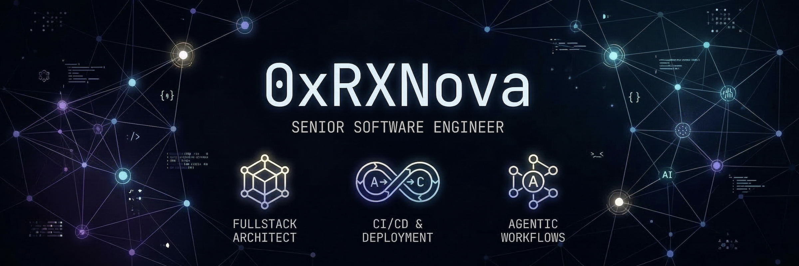

<p align="left">


</p>

### ⚡ System Diagnostics

```zsh
$ rxnova --init

> Verifying architectural integrity...... [ ████████████████ ] 100%
> Optimizing reactive streams............ [ ████████████████ ] 100%
> Purging technical debt................. [ DELETED ]
> Deploying AI Agents.................... [ ACTIVE ]

[READY]: System Resurrection Sequence Complete.

```

---

### 🛠 Tech Stack & Specialization

* **Fullstack Architecture:** Engineering end-to-end systems that don't just work—they scale.
* **DevOps & CI/CD:** Hardening the bridge between development and global production.
* **AI Agent Orchestration:** Building autonomous logic layers to replace manual overhead.

> *"I don't just maintain codebases; I resurrect legacy infrastructure into modern, agent-driven ecosystems."*
